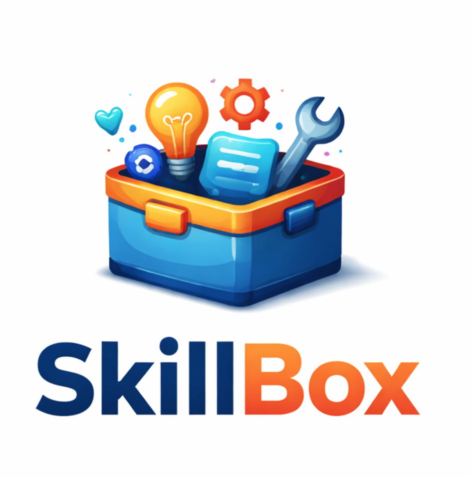

<div align="center">
  
</div>

# SkillBox

A curated collection of utility skills for Claude Code and AI agents. SkillBox provides reusable, battle-tested skills that enhance agent capabilities for common development workflows.

**Compatible with:** Claude Code, Cursor, Cline, GitHub Copilot, and 40+ other AI agents via [Vercel Skills](https://skills.sh)

**Install with:** `npx skills add antjanus/skillbox`

## What are Skills?

Skills are specialized instructions that teach Claude Code how to handle specific tasks or workflows. They activate automatically when relevant or can be invoked explicitly using `/skill-name`. Skills help enforce best practices, automate complex workflows, and provide consistent approaches to common development challenges.

## Installation

### Using Vercel Skills CLI (Recommended)

The easiest way to install SkillBox skills using the [Vercel Skills](https://skills.sh) ecosystem:

```bash
# Install all skills
npx skills add antjanus/skillbox

# Install specific skills
npx skills add antjanus/skillbox@track-session
npx skills add antjanus/skillbox@code-review
npx skills add antjanus/skillbox@ideal-react-component

# Install globally (available in all projects)
npx skills add antjanus/skillbox -g

# List installed skills
npx skills list

# Check for updates
npx skills check
```

The skills CLI automatically detects your agent (Claude Code, Cursor, Cline, etc.) and installs skills to the correct location.

### Alternative Installation Methods

<details>
<summary>Manual Global Installation</summary>

```bash
# Clone the repository
git clone https://github.com/antjanus/skillbox.git ~/.claude/skillbox

# Symlink skills to Claude Code's global skills directory
mkdir -p ~/.claude/skills
ln -s ~/.claude/skillbox/skills/* ~/.claude/skills/
```
</details>

<details>
<summary>Project-Specific Installation</summary>

```bash
# Add as git submodule
git submodule add https://github.com/antjanus/skillbox.git .claude/skillbox

# Or clone directly
git clone https://github.com/antjanus/skillbox.git .claude/skillbox

# Symlink desired skills
mkdir -p .claude/skills
ln -s ../.claude/skillbox/skills/track-session .claude/skills/track-session
ln -s ../.claude/skillbox/skills/code-review .claude/skills/code-review
```
</details>

<details>
<summary>Individual Skill Installation (curl)</summary>

```bash
# Copy specific skill to your project
mkdir -p .claude/skills/track-session
curl -o .claude/skills/track-session/SKILL.md \
  https://raw.githubusercontent.com/antjanus/skillbox/main/skills/track-session/SKILL.md
```
</details>

## Available Skills

13 skills. Click any name to jump to its use-cases and triggers; expand for details.

| Skill | What it does |
|-------|-------------|
| [🔄 track-session](#track-session) | Track, stop, resume, recover & verify long-running sessions |
| [⚙️ generate-skill](#generate-skill) | Interactive builder for high-quality `SKILL.md` files |
| [⚛️ ideal-react-component](#ideal-react-component) | React component structure + hooks antipatterns |
| [📊 rate-skill](#rate-skill) | Grade skill quality A–F with concrete fixes |
| [🗺️ track-roadmap](#track-roadmap) | Plan, update, audit & resume a project roadmap |
| [✅ track-qa](#track-qa) | Manual QA tracking — the things tests can't verify |
| [📦 setup-semantic-release](#setup-semantic-release) | Automated versioning via conventional commits |
| [📼 record-tui](#record-tui) | Polished terminal demo GIFs/MP4s with VHS |
| [📸 screenshot-local](#screenshot-local) | Screenshot local dev servers with shot-scraper |
| [🔍 code-review](#code-review) | Multi-agent local code review → `REVIEW.md` |
| [🔬 deep-research](#deep-research) | Multi-source web research with cited synthesis |
| [🎨 color-system](#color-system) | Curated color palettes + WCAG/APCA contrast guidance |
| [🔠 typography](#typography) | Type systems, scale, rhythm + a readability floor |

### track-session

<details>
<summary><b>Track, stop, resume, and save progress on long-running development sessions.</b></summary>

**Use when:**
- Working on multi-step implementations
- Planning complex features
- Need to pause and resume work
- Want checkpoint-based recovery

**Triggers:** Automatically activates on long-running collaborative work

[View Documentation](./skills/track-session/SKILL.md)
</details>

### generate-skill

<details>
<summary><b>Interactive skill builder that generates high-quality SKILL.md files using proven patterns.</b></summary>

**Use when:**
- Asked to "create a skill"
- Need to capture team workflows
- Want to extend Claude Code capabilities
- Building custom development methodologies

**Triggers:** When asked to "create a skill", "generate a SKILL.md", "make me a skill"

[View Documentation](./skills/generate-skill/SKILL.md)
</details>

### ideal-react-component

<details>
<summary><b>Battle-tested React component structure pattern for building maintainable, consistent components.</b></summary>

**Use when:**
- Creating new React components
- Refactoring existing components
- Debugging React hooks issues
- Reviewing component structure
- Organizing component code

**Triggers:** When asked to "create a React component", "structure this component", "review component structure", "refactor this component", "fix infinite loop", "useEffect not working"

[View Documentation](./skills/ideal-react-component/SKILL.md)
</details>

### rate-skill

<details>
<summary><b>Evaluate skill quality against best practices with letter grades (A-F) and actionable recommendations.</b></summary>

**Use when:**
- Reviewing skills before publishing
- Validating skill structure and formatting
- Checking if skill meets quality standards
- Auditing skill repositories

**Triggers:** When asked to "rate this skill", "review skill quality", "check skill formatting", "evaluate SKILL.md", "grade this skill"

[View Documentation](./skills/rate-skill/SKILL.md)
</details>

### track-roadmap

<details>
<summary><b>Plan, update, and audit a high-level project roadmap with interactive feature discovery.</b></summary>

**Use when:**
- Starting a new project and need to map out features
- Want to review what's been built vs. what's planned
- Need to audit and reprioritize the roadmap
- Capturing feature ideas before they're lost

**Triggers:** When asked to "create a roadmap", "plan features", "what should we build next", "update the roadmap", "audit the roadmap"

[View Documentation](./skills/track-roadmap/SKILL.md)
</details>

### track-qa

<details>
<summary><b>Plan, capture, and execute manual QA — the things tests can't verify (visual rendering, multi-step flows, race conditions, integrations, accessibility, performance feel).</b></summary>

Pairs with `track-roadmap` and `track-session` as the third member of the `cc-dash/*@1` schema family; failed items can file back to the roadmap as `r_xxxxx` issues.

**Use when:**
- Setting up a manual QA checklist before a release
- Auditing an existing QA list for relevance
- Migrating ad-hoc QA notes into the cc-dash schema
- Resuming a paused QA pass and picking the next pending item

**Triggers:** When asked to "create a QA list", "set up QA for this project", "audit the QA list", "what's left to QA", "before I ship I need to QA", "start manual QA"

[View Documentation](./skills/track-qa/SKILL.md)
</details>

### setup-semantic-release

<details>
<summary><b>Set up a fully automated versioning and release pipeline using conventional commits, commitlint, husky, and semantic-release.</b></summary>

**Use when:**
- Setting up automated versioning for a new project
- Adding conventional commits to an existing repo
- Migrating from manual versioning to automated releases
- Need commitlint, husky hooks, and CI/CD release workflow

**Triggers:** When asked to "set up semantic release", "add conventional commits", "configure automated versioning", "set up commitlint", "add husky hooks"

[View Documentation](./skills/setup-semantic-release/SKILL.md)
</details>

### record-tui

<details>
<summary><b>Record polished terminal demos using Charmbracelet VHS — reproducible GIFs, MP4s, and WebMs, version-controlled and CI-friendly.</b></summary>

**Use when:**
- Recording a demo GIF for a README or docs
- Creating video walkthroughs of CLI/TUI applications
- Writing VHS `.tape` files
- Setting up automated demo recording in CI/CD

**Triggers:** When asked to "record a demo", "create a GIF of my CLI", "write a VHS tape", "make a terminal recording", "generate a demo for my TUI"

[View Documentation](./skills/record-tui/SKILL.md)
</details>

### screenshot-local

<details>
<summary><b>Capture screenshots of local development projects using shot-scraper — localhost URLs and local HTML into PNGs, JPEGs, and PDFs.</b></summary>

**Use when:**
- Capturing screenshots of a local dev server for docs
- Batch screenshotting multiple pages/states via YAML config
- Documenting UI changes or new features visually
- Automating screenshot generation in CI/CD

**Triggers:** When asked to "screenshot my app", "capture the UI", "take a screenshot of localhost", "generate screenshots for docs", "batch screenshot my pages"

[View Documentation](./skills/screenshot-local/SKILL.md)
</details>

### code-review

<details>
<summary><b>Run a multi-agent code review over local changes — five specialized reviewers in parallel, synthesized into a severity-tagged report.</b></summary>

The five lanes: basics, architecture, clarity, testing, repo-hygiene.

**Use when:**
- Self-reviewing a change before committing
- Before opening a PR to flush issues you would fix anyway
- After a large refactor to catch structural drift
- Want pattern-aware feedback (architecture agent reads siblings first)
- Want to catch committed secrets, undocumented env vars, or stale docs (repo-hygiene)

**Triggers:** When asked to "review my code", "review these changes", "do a code review", "review this diff", "check my changes before I commit"

[View Documentation](./skills/code-review/SKILL.md)
</details>

### deep-research

<details>
<summary><b>Run multi-source web research and synthesize a comprehensive, well-sourced summary in the conversation.</b></summary>

Cross-references claims across 5-10+ searches, prioritizes current and authoritative sources, and surfaces disagreements honestly. No files created unless explicitly requested.

**Use when:**
- Pre-implementation research (libraries, patterns, trade-offs)
- Comparative analysis (Tool A vs Tool B vs Tool C)
- Catching up on recent developments in a fast-moving space
- Sanity-checking assumptions against authoritative sources

**Triggers:** When asked to "research X", "do a deep dive on Y", "look into Z", "investigate this topic", "what's the current state of X", "give me a thorough overview of Y"

[View Documentation](./skills/deep-research/SKILL.md)
</details>

### color-system

<details>
<summary><b>A curated library of ready-to-use color palettes (light + dark) across four domains, plus the methodology to build new palettes and verify accessibility.</b></summary>

Domains: web-app UI, marketing/landing, data visualization, and terminal/TUI. Every palette maps hexes to **semantic roles** so themes stay swappable and accessible by construction.

**Use when:**
- Picking a ready-made palette for an app, brand, chart, or terminal
- Building a new palette from scratch (OKLCH scales, harmony schemes)
- Setting up light & dark mode (dark mode ≠ inversion; elevation = lighter)
- Checking WCAG/APCA contrast or colorblind-safety

**Triggers:** When asked to "pick a color palette", "create a color scheme", "choose colors for my app", "set up dark mode", "what colors should I use", "data viz colors", or "check color contrast"

[View Documentation](./skills/color-system/SKILL.md)
</details>

### typography

<details>
<summary><b>Ready-to-use type systems plus the methodology to size text, build scales, set vertical rhythm, and pick fonts — so generated UI is readable instead of tiny, thin, and low-contrast.</b></summary>

Four systems (Product UI, Editorial, Marketing, Docs/Technical). Size by **role on a scale**, never eyeballed pixels, and keep text above the four-number **readability floor** (size ≥16px · weight ≥400 · contrast ≥4.5:1 · line-height ≥1.5).

**Use when:**
- Choosing a ready-made type system for an app, article, landing page, or docs
- Building a custom type scale (base × ratio) and vertical rhythm on an 8px grid
- Fixing unreadable text — too small, too thin, too low-contrast, too cramped
- Picking or pairing fonts (system stacks, curated webfonts, superfamilies)

**Triggers:** When asked to "what font size should I use", "set up a type scale", "this text is too small to read", "what line-height for body", "set up vertical rhythm", "pick a font for my dashboard", "pair a heading and body font", or "make typography fluid with clamp()"

[View Documentation](./skills/typography/SKILL.md)
</details>

## Usage

### Automatic Activation

Skills activate automatically when Claude detects relevant triggers:

```
user: Can you review my changes before I commit?
assistant: [Automatically activates code-review skill]
```

### Explicit Invocation

Call skills directly using slash commands:

```
user: /track-session
user: /code-review
user: /generate-skill database-migration
```

### Session-Specific Skills

Load skills for the current session only:

```
user: Load the track-session skill for this session
```

## Creating Custom Skills

Use the `generate-skill` skill to create your own:

```
user: /generate-skill my-workflow
```

Or use the Vercel Skills CLI to scaffold a new skill:

```bash
npx skills init my-workflow
```

Manually create following the [skill specification](https://agentskills.io/specification).

## Skill Structure

Each skill follows this standard structure:

```
skill-name/
├── SKILL.md              # Core skill documentation
├── references/           # Optional: Extended documentation (plural — canonical)
│   ├── STANDARDS.md      # Detailed rules
│   └── EXAMPLES.md       # Code examples
├── scripts/              # Optional: Automation scripts
│   ├── setup.sh
│   └── execute.sh
└── assets/               # Optional: Templates / resources used in output
    └── template.md
```

## Contributing

We welcome contributions! Here's how:

1. **Propose a New Skill**: Open an issue describing the workflow or problem
2. **Fork & Create**: Use `/generate-skill` to scaffold your skill
3. **Test Thoroughly**: Ensure activation triggers work correctly
4. **Document Well**: Follow existing skill documentation patterns
5. **Submit PR**: Include examples and use cases

### Skill Quality Standards

- **Trigger-rich descriptions**: Include 3-5 specific activation phrases
- **Clear examples**: Show ✅/❌ code comparisons (desired pattern first)
- **Troubleshooting**: Address common issues
- **Progressive disclosure**: Keep SKILL.md under 300 lines (hard cap 500); use `references/` for extensive content
- **Verification checklists**: For methodology enforcement skills

See [generate-skill documentation](./skills/generate-skill/SKILL.md) for detailed guidelines.

## Best Practices

### For Skill Users

1. **Trust the activation**: Skills activate when needed - no need to force them
2. **Use explicit invocation for clarity**: `/skill-name` when you want specific behavior
3. **Read the documentation**: Each skill has comprehensive usage examples
4. **Combine skills**: Many skills work well together (e.g., track-roadmap + track-session)

### For Skill Creators

1. **Clear triggers**: Write specific, recognizable activation phrases
2. **Verify, don't decree**: Enforce critical workflows with verification checklists and explained "Quality Signals" — not ALL-CAPS "Iron Laws" (Anthropic's skill-creator flags that framing as a yellow flag)
3. **Guide by default**: Provide recommendations with reasoning, not just rules
4. **Test activation**: Ensure your skill triggers reliably
5. **Version properly**: Use semantic versioning in metadata

## Philosophy

SkillBox skills follow these principles:

- **Activation over configuration**: Skills should activate when relevant
- **Verification over assumption**: Critical workflows get verification checkpoints
- **Examples over explanation**: Show, don't just tell
- **Progressive disclosure**: Start simple, reveal complexity when needed
- **Human and AI friendly**: Documentation that works for both

## Resources

- **Skills Directory**: https://skills.sh (discover and track SkillBox installations)
- **Vercel Skills CLI**: https://github.com/vercel-labs/skills (official CLI tool)
- **Claude Code Documentation**: https://code.claude.com/docs/
- **Skill Specification**: https://agentskills.io/specification
- **Best Practices Article**: https://antjanus.com/ai/claude-code-best-practices
- **CLAUDE.md Guide**: See [CLAUDE.md](./CLAUDE.md) in this repository
- **Agent Patterns**: See [AGENTS.md](./AGENTS.md) in this repository

## License

MIT License - see individual skills for specific licensing

---

**Skill Count**: 13 | **Made for**: Claude Code 2025+
